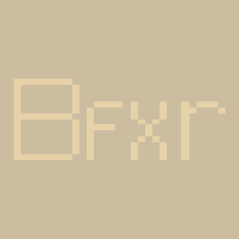

# Internship Bordeaux - Tsukuba 2017
## Game development in Java using LibGDX

Viêt Khang Le Ho - Sylvain Dupouy

---
<!-- page_number: true -->
<!-- footer: Internship Bordeaux - Tsukuba 2017 -->

# Table of contents

1. Imagining a game  
2. Developing a game
3. Demonstration
4. What we learned 

---
<!-- *page_number: false -->

# Imagining a game
**3 weeks**

---

# Imagining a game
## Finding a type of game

---

<!-- *footer: Imagining a game - Finding a type of game -->

### 5 ideas
* Music game :musical_note:
* Arcade game :joystick:
* Narrative/Interactive game :book:
* Rogue like :old_key:
* RPG :crossed_swords:

---

<!-- *footer: Imagining a game - Finding a type of game -->

### The one we picked :
**Narrative/Interactive  game :**
* Story > Gameplay
* Story forked at some points
* Player makes decisions
* Can be played again to obtain different outcomes

---

<!-- *footer: Imagining a game - Finding a type of game -->
### Finding the verbs
* RPG-like controls (move up, down, left, right)
* Interact with entities
* Enter a building
* Choose answer in a dialogue

---

# Imagining a game
## Prototyping

---

---

---

---
<!-- *footer: Imagining a game - Prototyping -->

### The tools
**Framework :** LÖVE 2D (Lua)
**For the sprites :** Piskel
**For the map edition :** Tiled
**For the tileset :** pokemonfangames.deviantart.com

---
<!-- *footer: Imagining a game - Prototyping -->
### The prototype scene

1. Story description
2. Events
3. Dialogues

---

<!-- *page_number: false -->
# Developing a game
**7 weeks**

---

# Developing a game
## Developing the engine
**5 weeks**

---
<!-- *footer: Developing a game - Developing the engine -->

Already existing interactive novel engines :
* Twine (Javascript)
* Ren' Py (Python)
* Interact (.NET) 

---
<!-- *footer: Developing a game - Developing the engine -->

### Why develop our own engine ?
* Specific controls
* Graphics
* World (with entities and interactions)

---
<!-- *footer: Developing a game - Developing the engine -->

### Our engine : 
* Tiled map (.tmx)
* XML dialogue files
* Asset manager
* Scene system

---

# Developing a game
## Outlining the scenes
**2 weeks**

---
<!-- *footer: Developing a game - Outlining the scenes -->

### What is a scene ?
* Setup -> Obstacle -> Goal
* Independent

---
<!-- *footer: Developing a game - Outlining the scenes -->

### Creativity

---
<!-- *page_number: false -->

# Demonstration

---
<!-- *page_number: false -->

# What we learned

---
<!-- *page_number: false -->

# What we learned
## Methodology

---

### Issues
* Avoid work conflicts
* Focus on a goal
* Measure work progress

---

### Branches

* Parallel developments
* Safe experimentations
* Clean up before merging

---

### Agile software development

* Weekly iteration
* Efficient face-to-face communication
* Feedback and adaption

---
<!-- *page_number: false -->

# What we learned
## Tools

### Game framework
* **LÖVE2D** : Lua framework for 2D games 
* **LibGDX** : Java framework for games 

### Assets
* **Bfxr** : 8-bit sounds generator 
* **Piskel** : animated sprite editor 
* **Tiled** : tiled map editor 

---
<!-- *page_number: false -->

# What we learned
## Game Design

* Minimum Viable Product
* Prototyping
* "Don't punish the player"

---
<!-- *page_number: false -->

# To conclude 

